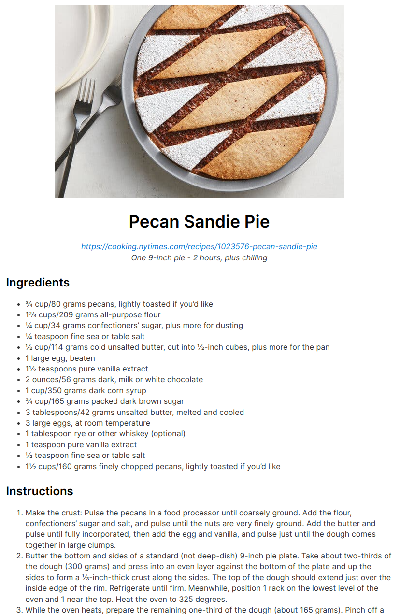
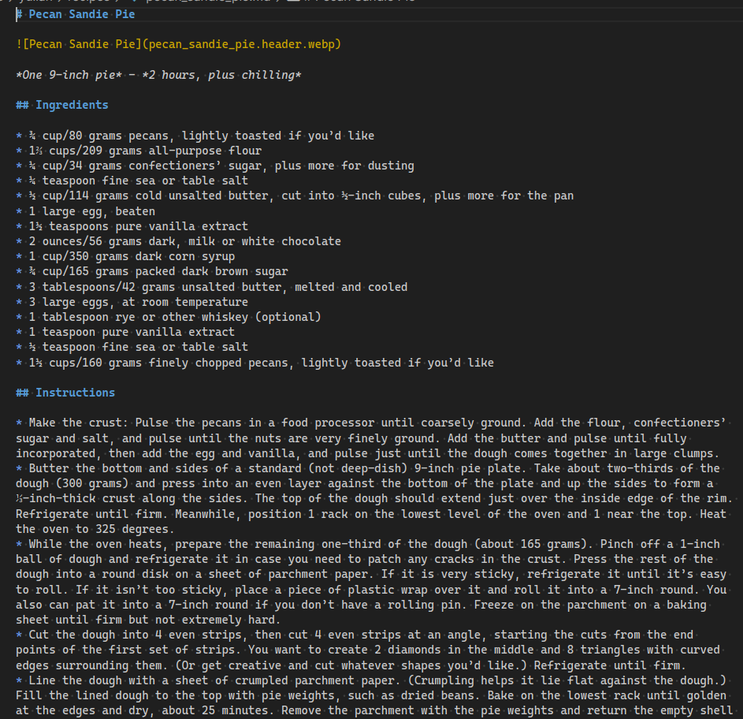

# NYT Cooking Recipe Downloader


`nyt_recipe` is a Python 3 script that is used to download recipes from
[NYT Cooking](https://cooking.nytimes.com/) and save them to a file in
a styled HTML and a Markdown format (with header images in both).

## Installation

```sh
poetry install
poetry shell
nyt_recipe URL
```

## Usage

Provide a URL or list of URLs to the script. The script will place the output
files in the `recipes` directory inside the current user's home directory, or
to the output directory specified by the `-o` argument. You can also provide
a file with a list of urls (1 per line) with `-f`.

```bash
$ nyt_recipe https://cooking.nytimes.com/recipes/1023576-pecan-sandie-pie
Saved recipe "Pecan Sandie Pie" to /home/yulian/recipes/pecan_sandie_pie.html and /home/yulian/recipes/pecan_sandie_pie.md
```




```sh
usage: nyt_recipe [-h] [-o PATH] [-f PATH] [-d] [-t] [-m] [-e] [-s] [URL ...]

Downloads recipes from NYT Cooking and saves them in a styled HTML and Markdown format

positional arguments:
  URL

options:
  -h, --help            show this help message and exit
  -o PATH, --output PATH
                        Output directory, defaults to ~/recipes
  -f PATH, --file PATH  A file holding a list of urls to download. URL(s) will be appended
  -d, --debug           Enable debug output
  -t, --no-html         Disable HTML output
  -m, --no-md           Disable Markdown output
  -e, --no-embed        Disables embedding images as data-uris, saves to file
  -s, --save-imgs       Save images to file, even if embedding
```
